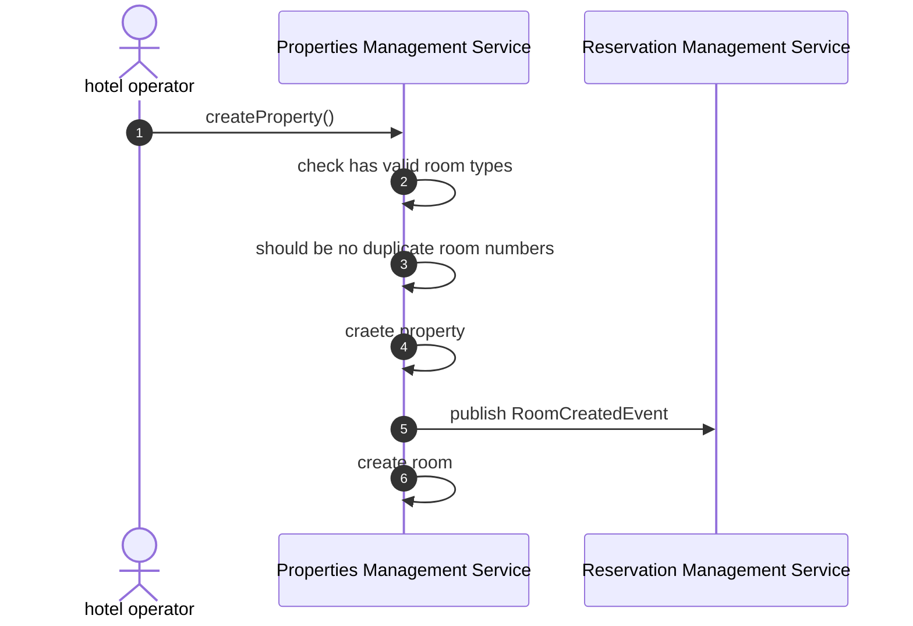
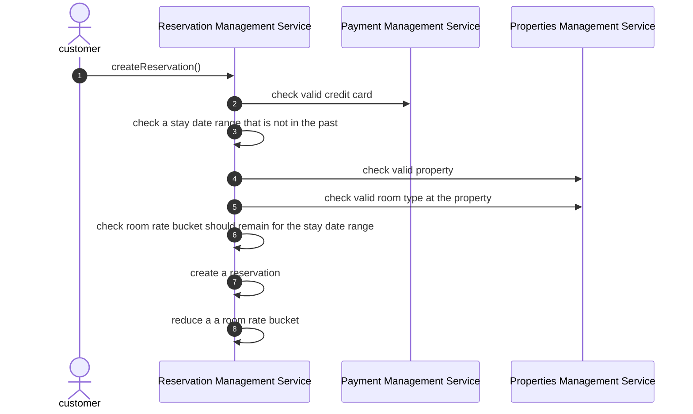
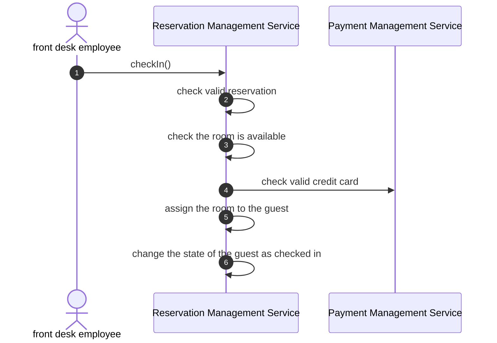
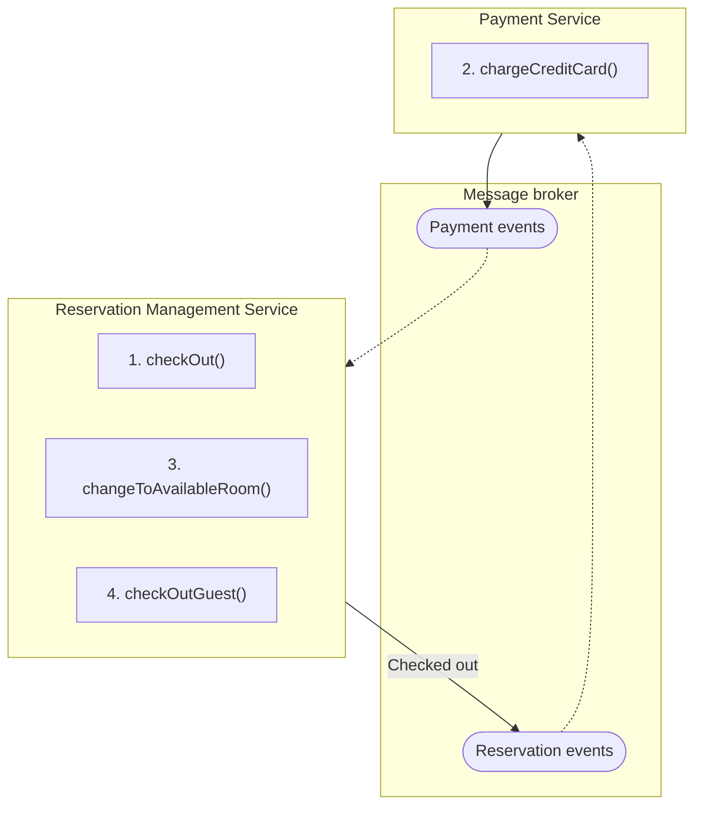
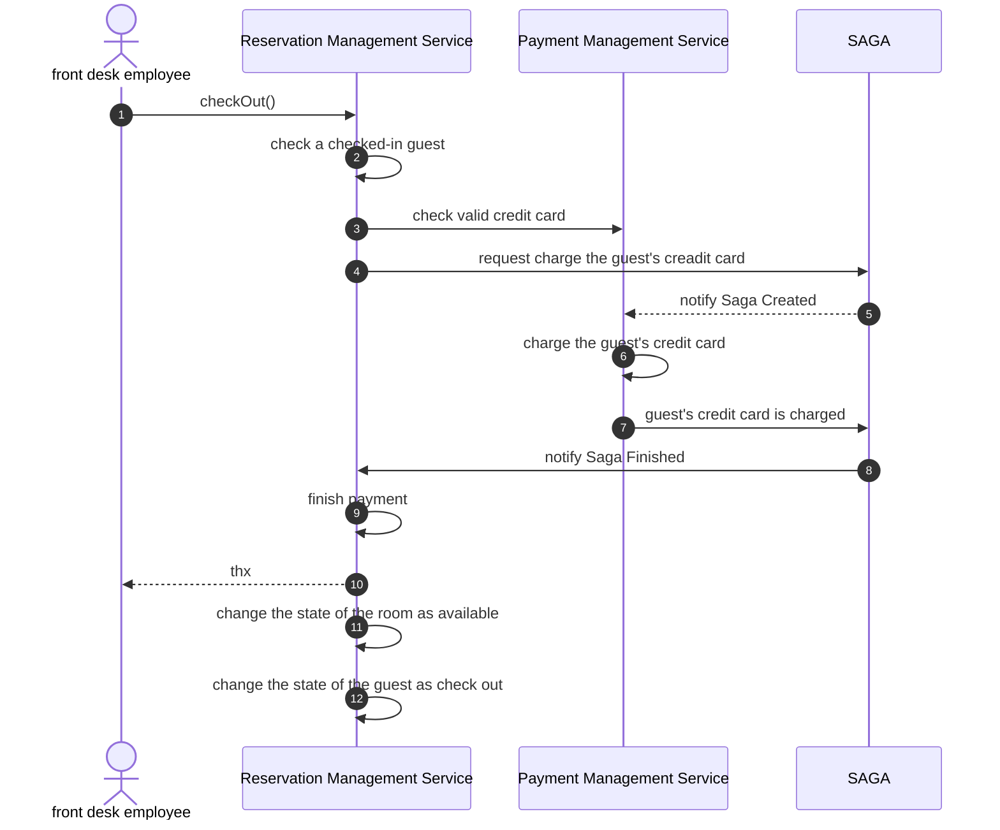

# microservice-marigold-hotels

## Glossary

| Korean | English | Description |
| --- | --- | --- |
| 호텔 | property | a hotel |
| 객실 | room | a physical room |
| 객실 유형 | room type | a type of room, e.g. "Deluxe King" |
| 날짜별 객실 유형 요금 | price chart | the pricing of a room type on a given day |
| 요금별 객실 유형 재고 | room rate bucket | quantity of rooms offered at a particular rate |
| 객실 요금 | room rate | a room rate |
| 예약 | reservation | a reservation of a room type for a range of days |
| 일별 예약 요금 | reserved rate | one for each day of reservation |
| 체크인 | check in | a room is assigned to the guest |
| 체크아웃 | check out | the status of the room is available |
| 고객 | customer | who can make reservations |
| 투숙객 | guest | makes reservations and stays at hotels |
| 호텔 운영자 | hotel operator | defines properties and pricing |
| 직원 | front desk employee | checks in and out guests |

## Identify system operations

### System operations

| Story | Command | Queries |
| --- | --- | --- |
| Create room type | createRoomType(name, description) |  |
| Create property | createProperty(name, address, rooms) |  |
| Create room rate | createRoomRate(propertyId, name, price) | - findProperties() |
| Set prices | setPrice(propertyId, date, roomType, [(quantity, roomRateId1), …]) | - findProperties() - findRoomTypesForProperty(propertyId) - findRoomRatesForProperty(propertyId) |
| Make reservation | createReservation(property, roomType, stayDateRange, dailyRoomRates, guest) | - findAvailableProperties(address, stayDateRange) - findAvailableRoomsAndRates(propertyId, stayDateRange) |
| Check in | checkIn(reservationId, roomNumber) | - findReservations(propertyId, searchCriteria) - findAvailableRooms(reservationId) |
| Check out | checkOut(reservationId) | - findReservations(propertyId, searchCriteria) |

### Command

#### createRoomType()

| Operation | createRoomType(name, description) |
| --- | --- |
| Returns |  |
| Preconditions | room type with that name does not exist |
| Postconditions | a room type was created |

#### createProperty()

| Operation | createProperty(name, address, rooms) |
| --- | --- |
| Returns |  |
| Preconditions | - has valid room types - should be no duplicate room numbers |
| Postconditions | a property was created |

#### createRoomRate()

| Operation | createRoomRate(propertyId, name, price) |
| --- | --- |
| Returns |  |
| Preconditions | room rate with that name does not exist at the property |
| Postconditions | a room rate was created |

#### setPrice()

| Operation | setPrice(propertyId, date, roomType, [(quantity, roomRateId1), …]) |
| --- | --- |
| Returns |  |
| Preconditions | - valid property - a date in the future - valid room type at the property - valid room rate and quantity pairs |
| Postconditions | a price chart was created |

#### createReservation()

| Operation | createReservation(property, roomType, stayDateRange, dailyRoomRates, guest) |
| --- | --- |
| Returns |  |
| Preconditions | - valid credit card - a stay date range that is not in the past - valid property - valid room type at the property - room rate bucket should remain for the stay date range |
| Postconditions | - a reservation was created - a room rate bucket has been reduced |

#### checkIn()

| Operation | checkIn(reservationId, roomNumber) |
| --- | --- |
| Returns |  |
| Preconditions | - valid reservation - valid credit card - the room is available |
| Postconditions | - the room is assigned to the guest - the state of the guest is checked in |

#### checkOut()

| Operation | checkOut(reservationId) |
| --- | --- |
| Returns |  |
| Preconditions | valid credit card |
| Postconditions | - the state of the room is available - the state of the guest is checked out - the guest's credit card is charged |

### Queries

| Query | Description |
| --- | --- |
| findProperties(searchCriteria) | Returns the list of properties |
| findRoomTypesForProperty(propertyId) | Returns the list of room types for the specified properties |
| findAvailableProperties(address, stayDateRange) | Returns the list of properties near the address that have availability for the specified stay date range |
| findAvailableRoomsAndRates(propertyId, stayDateRange) | Returns the available room rates for the specified property and stay date range |
| findReservations(propertyId, searchCriteria) | find the reservations for a property that match the search criteria |

## Define subdomains

### Property Management

| Name | Property Management |
| --- | --- |
| Responsibilities | manages information about properties |
| Collaborations | external address validation and geocoding service |
| Type | Supporting |
| Complexity | Simple |
| Key aggregates | Property |

### Reservation Management

| Name | Reservation Management |
| --- | --- |
| Responsibilities | manages information about reservations |
| Collaborations |  |
| Type | Core |
| Complexity | Complicated |
| Key aggregates | Reservation |

### Check In and Out Management

| Name | Check In and Out Management |
| --- | --- |
| Responsibilities | - executes check in and out - manages available rooms |
| Collaborations |  |
| Type | Supporting |
| Complexity | Simple |
| Key aggregates | Room |

### Payment Management

| Name | Payment Management |
| --- | --- |
| Responsibilities | makes payment |
| Collaborations |  |
| Type | Generic |
| Complexity | Simple |
| Key aggregates | CreditCard |

## Group subdomains into services

### Properties Management Service

- Property Management

### Reservation Management Service

- Reservation Management
- Check In and Out Management

### Payment Management Service

- Payment Management

## Design system operations

| Command | Service | Implementation |
| --- | --- | --- |
| createRoomType() | Properties Management Service | Local |
| createProperty() | Properties Management Service | Local |
| createRoomRate() | Reservation Management Service | Local |
| setPrice() | Reservation Management Service | Local |
| createReservation() | Reservation Management Service | Local |
| checkIn() | Reservation Management Service | Local |
| checkOut() | Reservation Management Service | Saga |

## Design system queries

| Query | Implementation |
| --- | --- |
| findProperties() | Properties Management Service |
| findRoomTypesForProperty() | Properties Management Service |
| findAvailableProperties() | API Composition |
| findAvailableRoomsAndRates() | Reservation Management Service |
| findReservations() | Reservation Management Service |

## Saga design

### createProperty()

### createReservation()

### checkIn()

### checkOut()

